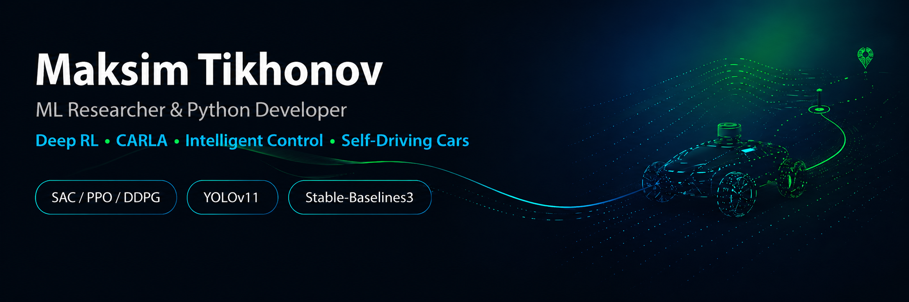

# Hi, I'm Maksim Tikhonov 👋

### ML Researcher & Python Developer
Deep Reinforcement Learning · Intelligent Control · Autonomous Ground Vehicles · CARLA Simulator

---

## 🚗 About me

I'm focused on machine learning methods for autonomous ground vehicles, including deep reinforcement learning, intelligent control, path planning and computer vision.

My current research direction is training and evaluating autonomous driving agents in the CARLA simulator, with an emphasis on reinforcement learning algorithms such as SAC, PPO and DDPG.

**Research interests**

- Deep Reinforcement Learning for autonomous driving
- Intelligent control of ground unmanned vehicles
- CARLA-based simulation and evaluation
- Path planning and vehicle control
- SAC, PPO and DDPG algorithms
- Stable-Baselines3
- Computer vision for autonomous vehicles
- Federated learning and YOLO-based object detection

---

## 🧠 Current focus

I work on research-oriented autonomous driving systems where reinforcement learning agents learn vehicle control in simulated environments.

Key directions:

- training RL agents for autonomous vehicle control
- designing reward functions for stable driving behavior
- evaluating lane keeping, trajectory stability and episode success rate
- comparing SAC, PPO and DDPG in CARLA
- combining simulation, control and computer vision methods

---

## 🛠 Tech stack

  
  
  
  
  
  
  
  

---

## 📚 Publications

### Intelligent control method for ground unmanned vehicles

Research on intelligent control and path planning methods for ground unmanned vehicles.

**Journal:** Nonlinear World, Vol. 24, No. 1, 2026  
**Pages:** 36–45  
**DOI:** [10.18127/j20700970-202601-03](https://doi.org/10.18127/j20700970-202601-03)

---

### Comparative analysis of DDPG, PPO and SAC for unmanned car control in CARLA

Research on deep reinforcement learning algorithms for autonomous driving in the CARLA simulator, comparing DDPG, PPO and SAC using Stable-Baselines3.

**Journal:** Research Result. Information Technologies, Vol. 9, No. 2, 2024  
**Pages:** 69–74  
**DOI:** [10.18413/2518-1092-2024-9-2-0-8](https://doi.org/10.18413/2518-1092-2024-9-2-0-8)

---

### Integrating Federated Learning and YOLOv11 for object detection in autonomous vehicles

Research on integrating federated learning with YOLOv11 for efficient and scalable object detection in autonomous vehicle systems.

**Journal:** Research Result. Information Technologies, Vol. 9, No. 4, 2024  
**Pages:** 58–64  
**DOI:** [10.18413/2518-1092-2024-9-4-0-7](https://doi.org/10.18413/2518-1092-2024-9-4-0-7)

---

## 📌 Featured work

### 🚗 Reinforcement Learning in CARLA

A research-oriented project focused on training and evaluating autonomous driving agents in the CARLA simulator using modern deep reinforcement learning algorithms.

Planned / current directions:

- SAC, PPO and DDPG training pipelines
- custom CARLA environments
- reward function experiments
- driving metrics and visualization
- comparison of trained agents
- simulation-based autonomous vehicle control

---

## 📊 GitHub stats

---

### Building intelligent agents for autonomous driving.

